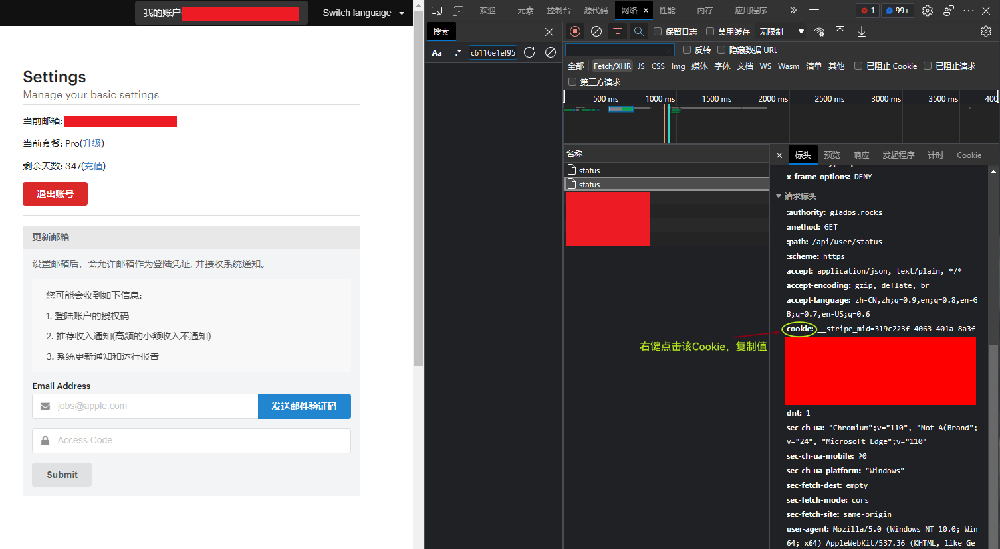
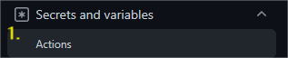

Daily Auto Check

1. **教育邮箱已经出现签到不给天数的问题，建议开一个Basic或者Pro套餐（新用户优惠套餐），其中Pro套餐可以分享出30天的Basic码（理论3个），也就是说可以4个人合作开1个Pro套餐和3个Basic套餐只花一份Pro套餐的钱。**
2. **提醒：actions 有可能被封禁，请自己保存好代码。**

## 注册地址以及步骤：

准备材料：普通邮箱，教育邮箱(领取免费一年)

1. 打开[Glados Github](https://github.com/glados-network/GLaDOS)，找到***Register***，打开链接，填写邮箱进行登录；无法打开的话，修改网络DNS为`8.8.8.8`，然后再访问[Glados官网](https://glados.rocks/)。

2. 新用户刚注册会免费赠送3天，打开右上角`Dashboard`，滑动滚轮一直到最下面，会出现一个`Education Plan`。

   

   点进去后，输入你的教育邮箱进行验证，验证成功会获赠一年。

3. Windows用户推荐使用Clash客户端进行配置下载。

   此处提供官网下载地址：[Clash官网下载](https://github.com/Fndroid/clash_for_windows_pkg)，[Clash汉化版下载](https://github.com/ender-zhao/Clash-for-Windows_Chinese)

## 脚本功能（自动签到）：

1、通过Github Action自动定时运行[main.py](./codes/main.py)脚本。

2、通过cookies自动登录（[https://glados.rocks/console/checkin](https://glados.rocks/console/checkin))，脚本会自动进行checkin。

3、然后通过"[Server酱](https://sct.ftqq.com/)", "Pushplus", "企业微信机器人", "Bark"或者“企业微信自建应用”，自动发送通知。

## 食用姿势：

1. 先“Fork”本仓库。（不需要修改任何文件！）

2. 注册GLaDOS，方法见上。

3. 登录GLaDOS后获取cookies。（简单获取方法：点击我的账户，浏览器快捷键F12，打开调试窗口，点击“network”获取，刷新页面）

   

4. 在自己刚刚Fork过来的仓库里的“Settings”里创建2个“Secrets”，分别是`USERS_DATA` `USERS_CLOSERS(可不填)`（后面有详细介绍），请务必使用**Json压缩后的格式填入**，不然会报错，此处提供 [json在线检查](https://www.sojson.com/)；

   

   

   

5. **Secrets格式要求：**

   - USERS_DATA（**必填**）

     - 支持多用户签到：此处填写格式为 `json`格式，示例：
       ````json
       [
           {
               "id": 0,
               "name": "an",
               "cookies": "xxx",
               "notice_tokens":{
                   "WECOM":{
                       "TYPE":"text or markdown",
                       "SECRET":"xxx",
                       "ENTERPRISE_ID":"xxx",
                       "APP_ID":"xxx"
                   },
                   "WECOM_WEBHOOK":"xxx",
                   "PUSHPLUS_TOKEN":"xxx",
                   "SERVER_SCKEY":"xxx",
                   "BARK_DEVICEKEY":"xxx"
               }
           },{...},
           # 默认使用父系设置，若用户自行有配置可覆盖父系设置。
           {
               "parent_notice_tokens":{
                   "WECOM":{
                       "TYPE":"text or markdown",
                       "SECRET":"xxx",
                       "ENTERPRISE_ID":"xxx",
                       "APP_ID":"xxx"
                   },
                   "WECOM_WEBHOOK":"xxx",
                   "PUSHPLUS_TOKEN":"xxx",
                   "SERVER_SCKEY":"xxx",
                   "BARK_DEVICEKEY":"xxx"
               }
           }
       ]

       // 示例1:
       // 多个账户使用同一通知通道，且只想要微信通知。
       [
           {
               "id": 0,
               "name": "aa",
               "cookies": "xxx"
           },{
               "id": 1,
               "name": "ss",
               "cookies": "xxx"
           },
           {
               "parent_notice_tokens":{
                   "WECOM":{
                       "TYPE":"text",
                       "SECRET":"xxx",
                       "ENTERPRISE_ID":"xxx",
                       "APP_ID":"xxx"
                   }
               }
       }
       ]
       // 压缩后的格式
       [{"id":0,"name":"aa","cookies":"xxx"},{"id":1,"name":"ss","cookies":"xxx"},{"parent_notice_tokens":{"WECOM":{"TYPE":"text","SECRET":"xxx","ENTERPRISE_ID":"xxx","APP_ID":"xxx"}}}]
       
       // 示例2
       // 指定用户使用私有通知通道,如id=0用户使用父微信通知通道，id=1使用自定义私有微信机器人通道。
       [
           {
               "id": 0,
               "name": "aa",
               "cookies": "xxx"
           },{
               "id": 1,
               "name": "ss",
               "cookies": "xxx",
             	"notice_tokens":{
                 "WECOM_WEBHOOK":"xxx"
               }
           },
           {
               "parent_notice_tokens":{
                   "WECOM":{
                       "TYPE":"text",
                       "SECRET":"xxx",
                       "ENTERPRISE_ID":"xxx",
                       "APP_ID":"xxx"
                   }
               }
           }
       ]
       // 压缩后
       [{"id":0,"name":"aa","cookies":"xxx"},{"id":1,"name":"ss","cookies":"xxx","notice_tokens":{"WECOM_WEBHOOK":"xxx"}},{"parent_notice_tokens":{"WECOM":{"TYPE":"text","SECRET":"xxx","ENTERPRISE_ID":"xxx","APP_ID":"xxx"}}}]
       ````
     - 其中 `notice_tokens`字段介绍：
       1. 企业微信自建应用 (WECOM) （选填）
          - TYPE （企业微信自建应用发送文本类型：有以下选择 `text`,`markdown`）(选填，默认 text)
          - SECRET (企业微信的secret)
          - ENTERPRISE_ID (在我的企业中查看企业ID)
          - APP_ID (自建通知APP的ID)
       2. SERVER_SCKEY（填写server酱sckey）(选填)
       3. WECOM_WEBHOOK (企业微信机器人的API)（选填）
       4. PUSHPLUS_TOKEN（Pushplus）（选填）
       5. BARK_DEVICEKEY （Bark）（选填）
     
   - USERS_CLOSERS (选填)

     1. 可以选择性关闭某一用户的签到, 采用 `json`格式填写:
        `{"pass_ids":[0,1...]}`
        示例（关闭id为2, 3用户的签到）:
        `{"pass_ids":[2,3]}`

6. 以上设置完毕后，每天上午11点会自动触发，并会执行自动main.py, 并发送通知，如要修改请修改`.github/workflows/daily_master.yml`文件中的cron语句。

7. **如果以上都不会的话，注册GLaDOS后，每天勤奋点记得登录后手动进行checkin即可。**

## 更新：

- [2022-5-12](./README.md)

  - 修复出现 token error的问题
    GLaDOS checkin 接口 request payload 中的 token 由 `"glados_network"` 更改为 `"glados.network"`
- [2022-7-2](./README.md)

  - 修复 触发反爬虫机制的问题([Author:](https://github.com/tyIceStream/GLaDOS_Checkin))
- [2022-8-27]()

  - 修改多用户的cookie，使用 `json`可视化更好
  - 可以选定指定 `id`用户取消打卡(避免频繁修改cookie的值)
- [2022-11-24]()

  - 参照其他作者修改消息通知通道，新增 `Pushplus`,``企业微信机器人``,`Bark`
