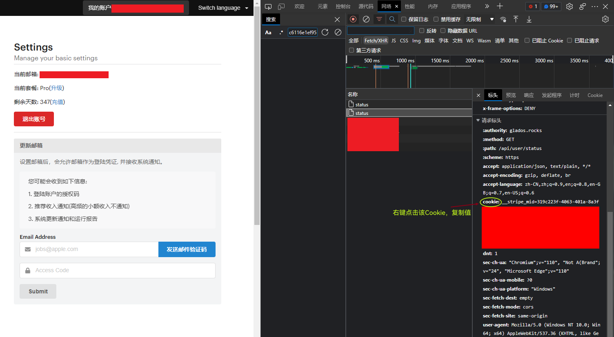

# Daily Auto Check

1. **教育邮箱已经出现签到不给天数的问题，建议开一个Basic或者Pro套餐（新用户优惠套餐），其中Pro套餐可以分享出30天的Basic码（理论3个），也就是说可以4个人合作开1个Pro套餐和3个Basic套餐只花一份Pro套餐的钱。**
2. **提醒：actions 有可能被封禁，请自己保存好代码。**

## 注册地址以及步骤：

准备材料：普通邮箱，教育邮箱(领取免费一年)

1. 打开[Glados Github](https://github.com/glados-network/GLaDOS)，找到***Register***，打开链接，填写邮箱进行登录；无法打开的话，修改网络DNS为 `8.8.8.8`，然后再访问[Glados官网](https://glados.rocks/)。
2. 新用户刚注册会免费赠送3天，打开右上角 `Dashboard`，滑动滚轮一直到最下面，会出现一个 `Education Plan`。

   

   点进去后，输入你的教育邮箱进行验证，验证成功会获赠一年。
3. Windows用户推荐使用Clash客户端进行配置下载。

   此处提供官网下载地址：[Clash官网下载](https://github.com/Fndroid/clash_for_windows_pkg)，[Clash汉化版下载](https://github.com/ender-zhao/Clash-for-Windows_Chinese)

## 脚本功能（自动签到）：

1、通过Github Action自动定时运行[glados/main.py](./codes/glados/main.py)脚本。

2、通过cookies自动登录（[https://glados.rocks/console/checkin](https://glados.rocks/console/checkin))，脚本会自动进行checkin。

3、然后通过"[Server酱](https://sct.ftqq.com/)", "Pushplus", "企业微信机器人", "Bark"或者“企业微信自建应用”，自动发送通知。

## 项目结构：

```
codes/
├── config.py    # 共用：用户与通知配置加载（从环境变量/Secrets读取）
├── notice.py    # 共用：通知发送（Server酱/Pushplus/企业微信/Bark）
├── glados/      # GLaDOS 签到，入口 glados/main.py
└── workbuddy/   # WorkBuddy 签到，入口 workbuddy/main.py
.github/workflows/
├── daily_master.yml       # GLaDOS 签到的 Action
└── workbuddy_checkin.yml  # WorkBuddy 签到的 Action
```

两套签到完全独立：各自有独立的 main 入口和 GitHub Action，互不影响；仅共用配置加载（config.py）与通知体系（notice.py）。

## 食用姿势：

1. 先“Fork”本仓库。（不需要修改任何文件！）
2. 注册GLaDOS，方法见上。
3. 登录GLaDOS后获取cookies。（简单获取方法：点击我的账户，浏览器快捷键F12，打开调试窗口，点击“network”获取，刷新页面）

   
4. 在自己刚刚Fork过来的仓库里的“Settings”里创建2个“Secrets”，分别是 `USERS_DATA` `USERS_CLOSERS(可不填)`（后面有详细介绍），请务必使用**Json压缩后的格式填入**，不然会报错，此处提供 [json在线检查](https://www.sojson.com/)；

   

   
5. **Secrets格式要求：**

   - USERS_DATA（**必填**）

     - 支持多用户签到：此处填写格式为 `json`格式，示例：
       ````json
       [
           {
               "notice":"notice_1", //此处是选择通知的通道（在下面group_notices配置），一组只能选一种通知方式,选填。
               "group":[
                   {
                       "id": 0,
                       "name": "an",
                       "cookies": "xxx"
                   },...,
                   {
                       "id": 10x,
                       "name": "anx",
                       "cookies": "xxx"
                   }
               ]
           },...,
           {
               "notice":"notice_x",
               "group":[
                   {
                       "id": 11x,
                       "name": "an",
                       "cookies": "xxx"
                   },...,
                   {
                       "id": 20x,
                       "name": "anx",
                       "cookies": "xxx"
                   }
               ]
           },
           {
               # 若没有通知需求，可空白。
               "group_notices": {
                   # 每个组中的通知方式选填，若没有则不通知。
                   # notice_1 可自定义，上面notice字段引用正确即可。
                   "notice_1": {
                       "WECOM":{
                           "TYPE":"text(markdown)",
                           "SECRET":"xxx",
                           "ENTERPRISE_ID":"xxx",
                           "APP_ID":"xxx"
                       }
                   },
                   "notice_x": {
                       "WECOM":{
                           "TYPE":"text(markdown)",
                           "SECRET":"xxx",
                           "ENTERPRISE_ID":"xxx",
                           "APP_ID":"xxx"
                       },
                       "WECOM_WEBHOOK":"xxx",
                       "PUSHPLUS_TOKEN":"xxx",
                       "SERVER_SCKEY":"xxx",
                       "BARK_DEVICEKEY":"xxx"
                   }
               }
           }
       ]

       // 示例
       // 多个账户使用同一通知通道，且只想要微信通知。
       [
           {
               "notice":"推送1",
               "group":[
                   {
                       "id": 0,
                       "name": "an",
                       "cookies": "xxx"
                   },
                   {
                       "id": 1,
                       "name": "anx",
                       "cookies": "xxx"
                   }
               ]
           },
           {
               "group_notices": {
                   "推送1": {
                       "WECOM":{
                           "TYPE":"text(markdown)",
                           "SECRET":"xxx",
                           "ENTERPRISE_ID":"xxx",
                           "APP_ID":"xxx"
                       },
                   }
               }
           }
       ]

       // 压缩后的格式
       [{"notice":"推送1","group":[{"id":0,"name":"an","cookies":"xxx"},{"id":1,"name":"anx","cookies":"xxx"}]},{"group_notices":{"推送1":{"WECOM":{"TYPE":"text(markdown)","SECRET":"xxx","ENTERPRISE_ID":"xxx","APP_ID":"xxx"},"WECOM_WEBHOOK":"xxx","PUSHPLUS_TOKEN":"xxx"}}}]
       ````
     - 其中 `group_notices`下的 `notice_x`字段介绍：
       1. 企业微信自建应用 (WECOM) （选填）
          - TYPE （企业微信自建应用发送文本类型：有以下选择 `text`,`markdown`）(选填，默认 text)
          - SECRET (企业微信的secret)
          - ENTERPRISE_ID (在我的企业中查看企业ID)
          - APP_ID (自建通知APP的ID)
       2. SERVER_SCKEY（填写server酱sckey）(选填)
       3. WECOM_WEBHOOK (企业微信机器人的API)（选填）
       4. PUSHPLUS_TOKEN（Pushplus）（选填）
       5. BARK_DEVICEKEY （Bark）（选填）
   - USERS_CLOSERS (选填)

     1. 可以选择性关闭某一用户的签到, 采用 `json`格式填写:
        `{"pass_ids":[0,1...]}`
        示例（关闭id为2, 3用户的签到）:
        `{"pass_ids":[2,3]}`
6. 以上设置完毕后，每天上午11点会自动触发，并会执行自动main.py, 并发送通知，如要修改请修改[daily_master.yml](.github/workflows/daily_master.yml)文件中的cron语句。
7. **如果以上都不会的话，注册GLaDOS后，每天勤奋点记得登录后手动进行checkin即可。**

## WorkBuddy（CodeBuddy）每日签到：

1. 通过 Github Action 自动定时运行 [codes/workbuddy/main.py](./codes/workbuddy/main.py)，调用 WorkBuddy 的签到接口领取每日积分。
2. 通知复用本项目的通知体系（Server酱/Pushplus/企业微信/Bark 等），配置方式与 GLaDOS 相同（见上 `group_notices` 说明）。

### 配置方法：

1. 获取 accessToken：WorkBuddy/CodeBuddy 桌面端登录后，在本地 auth 文件中获取（macOS 路径：`~/Library/Application Support/CodeBuddyExtension/Data/Public/auth/workbuddy-desktop.info`），取其中 `auth.accessToken` 字段的值。

   > 也可以直接用脚本自动提取（Windows / macOS / Linux 通用）：
   > ```bash
   > python -m codes.workbuddy.gen_data            # 生成到 workbuddy_data.txt
   > python -m codes.workbuddy.gen_data --print    # 只打印，不写文件
   > ```
   > 脚本会自动定位本机登录态、提取 accessToken 并输出压缩 JSON；若输出文件已存在，会复用其中的 `group_notices` 通知配置，只刷新 token。
2. 在仓库 Settings → Secrets 中创建 `WORKBUDDY_DATA`（**必填**，务必使用 **Json压缩后的格式** 填入），格式与 `USERS_DATA` 一致，只是账号字段用 `access_token` 代替 `cookies`：

   ````json
   [
       {
           "notice":"推送1",
           "group":[
               {
                   "id": 0,
                   "name": "an",
                   "access_token": "xxx"
               }
           ]
       },
       {
           "group_notices": {
               "推送1": {
                   "SERVER_SCKEY":"xxx"
               }
           }
       }
   ]
   ````

   压缩后的格式示例：
   `[{"notice":"推送1","group":[{"id":0,"name":"an","access_token":"xxx"}]},{"group_notices":{"推送1":{"SERVER_SCKEY":"xxx"}}}]`

3. `WORKBUDDY_CLOSERS`（选填）：格式同 `USERS_CLOSERS`，如 `{"pass_ids":[0,1]}` 可跳过指定 id 的账号。
4. 每天 UTC 2:00（北京时间上午10点）自动触发，可在 [workbuddy_checkin.yml](.github/workflows/workbuddy_checkin.yml) 中修改 cron，也可在 Actions 页面手动触发（workflow_dispatch）。

## 更新：

- [2026-08-29](./README.md)

  - 项目结构整理：按签到目标拆分为 `codes/glados` 与 `codes/workbuddy`，各自独立 main 入口与 GitHub Action，共用 `config.py` 与 `notice.py`
  - 新增 WorkBuddy（CodeBuddy）每日签到，通知接入现有 `notice.py` 通知体系
- [2022-5-12](./README.md)

  - 修复出现 token error的问题
    GLaDOS checkin 接口 request payload 中的 token 由 `"glados_network"` 更改为 `"glados.network"`
- [2022-7-2](./README.md)

  - 修复 触发反爬虫机制的问题([Author:](https://github.com/tyIceStream/GLaDOS_Checkin))
- [2022-8-27]()

  - 修改多用户的cookie，使用 `json`可视化更好
  - 可以选定指定 `id`用户取消打卡(避免频繁修改cookie的值)
- [2022-11-24]()

  - 参照其他作者修改消息通知通道，新增 `Pushplus`,``企业微信机器人``,`Bark`
