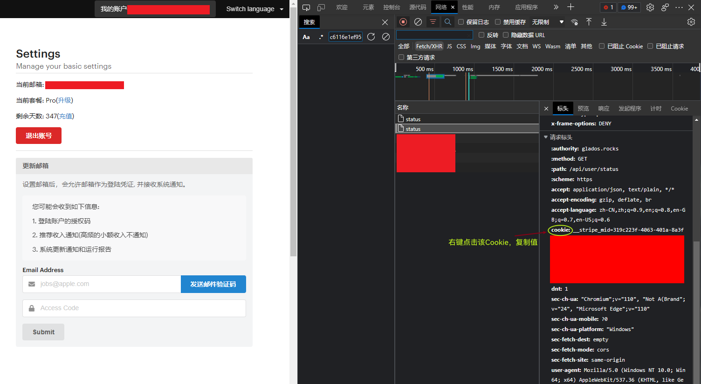

# Daily Auto Check

1. **教育邮箱已经出现签到不给天数的问题，建议开一个Basic或者Pro套餐（新用户优惠套餐），其中Pro套餐可以分享出30天的Basic码（理论3个），也就是说可以4个人合作开1个Pro套餐和3个Basic套餐只花一份Pro套餐的钱。**
2. **提醒：actions 有可能被封禁，请自己保存好代码。**

## 脚本功能（自动签到）：

1、通过Github Action自动定时运行[glados/main.py](./codes/glados/main.py)脚本。

2、通过cookies自动登录（[https://glados.rocks/console/checkin](https://glados.rocks/console/checkin))，脚本会自动进行checkin。

3、然后通过"[Server酱](https://sct.ftqq.com/)", "Pushplus", "企业微信机器人", "Bark"或者“企业微信自建应用”，自动发送通知。

## 项目结构：

```
codes/
├── __init__.py  # 各层都要有，否则会被 site-packages 里的同名包吞掉
├── config.py    # 共用：用户与通知配置加载（扫描 GLADOS_USER_* / WORKBUDDY_USER_* 环境变量）
├── notice.py    # 共用：通知发送（Server酱/Pushplus/企业微信/Bark）
├── glados/      # GLaDOS 签到，入口 glados/main.py
└── workbuddy/   # WorkBuddy 签到，入口 workbuddy/main.py
.github/workflows/
├── daily_master.yml       # GLaDOS 签到的 Action
└── workbuddy_checkin.yml  # WorkBuddy 签到的 Action
```

两套签到完全独立：各自有独立的 main 入口和 GitHub Action，互不影响；共用配置加载（config.py）、通知体系（notice.py）和共享通知变量 `NOTICES`。

> Actions 会先用一步把所有 Secret 写入 `GITHUB_ENV`，脚本再通过 `os.environ` 按前缀自动扫描。这样新增账号只需在 Secrets 里加一个变量，不用改 workflow。

## 浏览器方案

GLaDOS 有 Cloudflare 反爬，必须在真实浏览器里请求，因此**统一用 playwright + 自带的 chromium**，
一套代码同时跑 GitHub Actions 和呆呆面板，不再依赖系统 Chrome / selenium / undetected_chromedriver。

依赖只有两个（见 `requirements.txt`），版本钉死且与面板环境完全一致，两边跑的是同一套浏览器：

```
playwright==1.63.0
requests==2.34.2
```

装完包还要装浏览器：

```bash
pip install -r requirements.txt
playwright install --with-deps chromium   # macOS 上可省 --with-deps
```

`Checkin.resolve_browsers_path()` 会依次尝试 `PLAYWRIGHT_BROWSERS_PATH` → 面板自带目录 →
`~/.cache/ms-playwright`，所以两个环境不用改代码就能直接找到浏览器。

> 为什么不用系统 Chrome？GitHub Actions 的 ubuntu runner 确实自带 Chrome 和 ChromeDriver，
> 但面板容器里没有；为了两边一套代码，统一走 playwright 自带的 chromium。

## Secrets 配置（前缀变量模式）

每个账号一个环境变量（Secret），变量名以 `GLADOS_USER_` / `WORKBUDDY_USER_` 为前缀，
后缀是账号标识，例如 `GLADOS_USER_SULIVIA`、`WORKBUDDY_USER_ANDY`。
脚本通过 `os.environ` 按前缀自动扫描，新增账号只需在 Secrets 加一个变量。

> 旧的单变量 `USERS_DATA` / `USERS_CLOSERS` / `WORKBUDDY_DATA` / `WORKBUDDY_CLOSERS` 已废弃，
> 请从仓库 Secrets 中删除，换成下面的新格式。

### 1. 共享通知：`NOTICES`（选填，两套签到共用）

给通知渠道起名字，账号里通过名字引用，避免多账号重复填写：

```json
{
  "企业微信": {"WECOM": {"TYPE": "text", "SECRET": "xxx", "ENTERPRISE_ID": "xxx", "APP_ID": "xxx"}},
  "企业微信机器人": {"WECOM_WEBHOOK": "https://qyapi.weixin.qq.com/cgi-bin/webhook/send?key=xxx"}
}
```

### 2. 账号变量格式

GLaDOS 账号（用 `cookies`）：

```json
{"name": "Sulivia", "cookies": "koa:sess=xxx; koa:sess.sig=xxx", "notice": "企业微信", "auto_exchange": false}
```

WorkBuddy 账号（用 `access_token`）：

```json
{"name": "Andy", "access_token": "xxx", "notice": "企业微信"}
```

字段说明：

- `name`：选填，展示名，不填则用变量名后缀（如 `SULIVIA`）
- `cookies` / `access_token`：必填，账号凭据
- `auto_exchange`：选填，**仅 GLaDOS 使用**，是否在签到后自动兑换积分，默认 `false`（不写即关闭），见下方[自动兑换最高档套餐](#自动兑换最高档套餐)
- `notice`：选填，该账号的通知渠道，三种写法：
  1. `"企业微信"` —— 字符串，引用 `NOTICES` 里的同名条目（**推荐**）
  2. `{"name": "企业微信", "data": {...}}` —— 单通道写法
  3. `{"WECOM": {...}, "SERVER_SCKEY": "..."}` —— 完整写法，可同时配多个通道

  通道支持的配置键（与 notice.py 对应）：
  - `WECOM`（企业微信自建应用）：`TYPE`（`text`/`markdown`，默认 text）、`SECRET`、`ENTERPRISE_ID`、`APP_ID`
  - `WECOM_WEBHOOK`（企业微信机器人）
  - `SERVER_SCKEY`（Server酱）
  - `PUSHPLUS_TOKEN`（Pushplus）
  - `BARK_DEVICEKEY`（Bark）
- 变量值也可以是纯字符串（直接粘 token），表示只签到、不发通知
- 跳过某个账号：直接从仓库 Secrets 删掉对应变量即可

### 自动兑换最高档套餐

在 GLaDOS 账号 JSON 里加上 `"auto_exchange": true` 即可开启（默认关闭）。
开启后，每次签到成功会多走一步：

1. 查询 `GET /api/user/points`，拿到当前 `points` 与所有 `plans`；
2. 从 `plans`（`plan100` / `plan200` / `plan500`）中挑出所需积分**最高**的那档；
3. 若当前积分 ≥ 该档所需积分，则自动兑换。

行为说明：

- 积分不足时只打印日志、不发送通知，不会有额外打扰；
- 兑换成功 / 失败会作为一行附加信息，出现在原有的签到通知里；
- 积分查询异常不会中断签到，只在通知里提示「已跳过」。

```json
{"name": "Sulivia", "cookies": "koa:sess=xxx", "notice": "企业微信", "auto_exchange": true}
```

> ⚠️ 兑换接口尚未接入：`codes/glados/checkin.py` 中的 `Checkin.EXCHANGE_URL` 目前是空字符串，
> 此时即使开关打开也不会发出任何兑换请求，仅提示「接口尚未接入」。
> 拿到真实接口后，只需填 `EXCHANGE_URL` 并按文档调整 `build_exchange_request()` 里的
> 请求方法和 body 字段，其余流程无需改动。

## 食用姿势（GLaDOS）：

1. 先“Fork”本仓库。（不需要修改任何文件！）
2. 登录GLaDOS后获取cookies。（简单获取方法：点击我的账户，浏览器快捷键F12，打开调试窗口，点击“network”获取，刷新页面）

   
3. 在自己刚刚Fork过来的仓库里的“Settings → Secrets and variables → Actions”里创建 Secrets：
   - `NOTICES`（选填）：共享通知配置，见上
   - `GLADOS_USER_SULIVIA`（**必填**，每账号一个）：JSON 格式填入（支持换行/缩进，**无需压缩**），此处提供 [json在线检查](https://www.sojson.com/)
4. 以上设置完毕后，每天上午10点会自动触发，并会执行自动签到，并发送通知，如要修改请修改[daily_master.yml](.github/workflows/daily_master.yml)文件中的cron语句。
5. **如果以上都不会的话，注册GLaDOS后，每天勤奋点记得登录后手动进行checkin即可。**

## WorkBuddy（CodeBuddy）每日签到：

1. 通过 Github Action 自动定时运行 [codes/workbuddy/main.py](./codes/workbuddy/main.py)，调用 WorkBuddy 的签到接口领取每日积分。
2. 通知复用本项目的通知体系，共享配置 `NOTICES` 与 GLaDOS 通用。
3. 这条链路只用 `requests`，不需要浏览器，所以 workflow 里没有装 chromium 的步骤；
   依赖仍与 GLaDOS 共用同一份 `requirements.txt`，两个 workflow 只有「是否装浏览器」这一步不同。

### 配置方法：

1. 获取 accessToken：WorkBuddy/CodeBuddy 桌面端登录后，在本地 auth 文件中获取（macOS 路径：`~/Library/Application Support/CodeBuddyExtension/Data/Public/auth/workbuddy-desktop.info`），取其中 `auth.accessToken` 字段的值。

   > 也可以直接用脚本自动提取（Windows / macOS / Linux 通用）：
   > ```bash
   > python -m codes.workbuddy.gen_data            # 生成到 workbuddy_user.txt
   > python -m codes.workbuddy.gen_data --print    # 只打印，不写文件
   > python -m codes.workbuddy.gen_data -n Andy    # 指定账号名（决定变量名后缀）
   > ```
   > 脚本会自动定位本机登录态并输出 `变量名=JSON` 格式的一行，整行复制到仓库 Secrets 即可；
   > 若输出文件已存在，会复用其中的 notice 通知配置，只刷新 token。
2. 在仓库 Settings → Secrets 中创建：
   - `NOTICES`（选填）：与 GLaDOS 共用
   - `WORKBUDDY_USER_ANDY`（**必填**，每账号一个）：

   ```json
   {"name": "Andy", "access_token": "xxx", "notice": "企业微信"}
   ```
3. 每天自动触发，可在 [workbuddy_checkin.yml](.github/workflows/workbuddy_checkin.yml) 中修改 cron，也可在 Actions 页面手动触发（workflow_dispatch）。

## 部署到呆呆面板（Dumb-Panel）

除了 GitHub Actions，本仓库也可以直接跑在自建的呆呆面板上。两边**共用同一套代码、同一个浏览器方案**：

| 项 | GitHub Actions | 呆呆面板（容器） |
| --- | --- | --- |
| Python | 3.12 | 3.12 |
| 依赖 | `pip install -r requirements.txt`（版本与面板一致） | 面板已装好同名同版本 |
| 浏览器 | workflow 里 `playwright install --with-deps chromium` | 面板自带 playwright + chromium |
| 浏览器目录 | 默认 `~/.cache/ms-playwright` | 已由面板设好 `PLAYWRIGHT_BROWSERS_PATH` |
| 运行目录 | 仓库根目录 | 脚本目录 `/app/Dumb-Panel/scripts` |
| 任务命令 | `python -m codes.glados.main` | `python -m AstbReal_dailyAutoCheck.codes.glados.main` |

面板任务只有一个差异：面板用 `runpy.run_module()` 在面板 python 进程里执行 `command`，
所以 `command` 填的是**模块路径**而不是 shell 命令；`task_before` 里的 `cd` 也不会传给主命令。

四个必踩的坑（已在本仓库代码里处理，改动时勿回退）：

1. **包名遮蔽**：容器 site-packages 里装有 PyPI 的 `codes 0.1.5`（与本地 `codes/` 目录同名）。
   如果 `codes/` 没有 `__init__.py`，它只是命名空间包，会输给已安装的真实包，
   报 `ModuleNotFoundError: No module named 'codes.glados'`。因此仓库内统一用**相对导入**
   （`from ..notice import ...`），并补齐了各层 `__init__.py`（`.gitignore` 里**不能再忽略**
   `__init__.py`，否则文件进不了仓库，这个坑会在新环境重现）。
2. **反爬判定**：GLaDOS 会拒掉 `HeadlessChrome` 和 **Linux 平台**的 UA，
   返回 `code=4 Automated check-in detected`。因此 `Checkin.resolve_user_agent()`
   统一伪装成 Windows 桌面版 Chrome（版本号沿用浏览器真实主版本），并配合反自动化 init script。
3. **SPA 卡住 DOMContentLoaded**：站点部分子资源会长期挂起，导致 `DOMContentLoaded` 永不触发，
   所以 Playwright 用 `wait_until="commit"` 导航，不等待 document 加载完成。
4. **浏览器目录**：面板的 chromium 不在默认缓存目录，靠 `PLAYWRIGHT_BROWSERS_PATH` 定位；
   `resolve_browsers_path()` 做了三级回退，两个环境都不用配。

## 更新：

- [2026-09-29](./README.md)

  - **统一浏览器方案**：GLaDOS 签到不再分两套，一律走 playwright + 自带的 chromium
    （原来是 selenium + undetected_chromedriver）。面板容器没有系统 Chrome，
    而 playwright 的 chromium 在两边都能用，从此只剩一条代码路径
  - `requirements.txt`：移除 `selenium` / `undetected_chromedriver`，改为 `playwright==1.63.0`
  - `daily_master.yml`：runner 由 `macos-14` 改为 `ubuntu-latest`（原来用 mac 只是因为镜像自带 Chrome，
    改用 playwright 后不再需要，ubuntu 计费低得多），并新增一步 `playwright install --with-deps chromium`
  - 浏览器 UA 伪装为 Windows 桌面版 Chrome：GLaDOS 反爬会拒掉 `HeadlessChrome` 与
    **Linux 平台** UA（返回 `code=4 Automated check-in detected`）
  - GLaDOS 是 SPA，部分子资源长期挂起导致 `DOMContentLoaded` 永不触发，改用 `wait_until="commit"` 导航
  - 仓库内导入改为相对导入，并补齐 `codes` / `codes/glados` / `codes/workbuddy` 的 `__init__.py`，
    同时从 `.gitignore` 移除对 `__init__.py` 的忽略，
    避免与 site-packages 里的同名 `codes` 包（PyPI `codes 0.1.5`）冲突
  - **运行环境与依赖对齐面板**：两个 workflow 的 Python 都由 3.10 改为 **3.12**，
    `actions/checkout` / `actions/setup-python` 由 v4 升到 v6
  - `requirements.txt` 补齐 `requests==2.34.2`（此前不锁版本），
    workbuddy 与 GLaDOS 两条 workflow 共用这一份依赖，避免两处版本漂移
- [2026-09-25](./README.md)

  - GLaDOS 账号配置新增 `auto_exchange` 开关（默认 `false`）：签到后查询积分，满足最高档套餐即自动兑换
  - 兑换结果作为附加行并入原有签到通知；积分查询异常不中断签到
  - 兑换接口地址待补充（`Checkin.EXCHANGE_URL` 为空时不发请求）
- [2026-09-12](./README.md)

  - 移除「注册地址以及步骤」章节，README 专注部署与配置说明
  - 明确 Secrets 里的 JSON **无需压缩**（支持换行/缩进）
  - 修正更新日志中已过时的 Actions 注入方式描述
- [2026-09-05](./README.md)

  - Secrets 改为前缀变量模式：每个账号一个 `GLADOS_USER_XXX` / `WORKBUDDY_USER_XXX` 变量，新增账号只需加一个 Secret
  - 通知配置统一：`GLADOS_NOTICES` / `WORKBUDDY_NOTICES` 合并为共享的 `NOTICES`，账号 notice 支持字符串引用共享渠道
  - 移除 closers（`USERS_CLOSERS` / `WORKBUDDY_CLOSERS`）相关逻辑，跳过账号改为直接删除对应 Secret
  - Actions 改为预步骤把 Secret 注入 `GITHUB_ENV`，脚本按前缀自动扫描
  - gen_data.py 改为输出 `WORKBUDDY_USER_XXX=JSON` 格式，便于直接粘贴到 Secrets
- [2026-08-29](./README.md)

  - 项目结构整理：按签到目标拆分为 `codes/glados` 与 `codes/workbuddy`，各自独立 main 入口与 GitHub Action，共用 `config.py` 与 `notice.py`
  - 新增 WorkBuddy（CodeBuddy）每日签到，通知接入现有 `notice.py` 通知体系
- [2022-5-12](./README.md)

  - 修复出现 token error的问题
    GLaDOS checkin 接口 request payload 中的 token 由 `"glados_network"` 更改为 `"glados.network"`
- [2022-7-2](./README.md)

  - 修复 触发反爬虫机制的问题([Author:](https://github.com/tyIceStream/GLaDOS_Checkin))
- [2022-8-27]()

  - 修改多用户的cookie，使用 `json`可视化更好
  - 可以选定指定 `id`用户取消打卡(避免频繁修改cookie的值)
- [2022-11-24]()

  - 参照其他作者修改消息通知通道，新增 `Pushplus`,``企业微信机器人``,`Bark`
